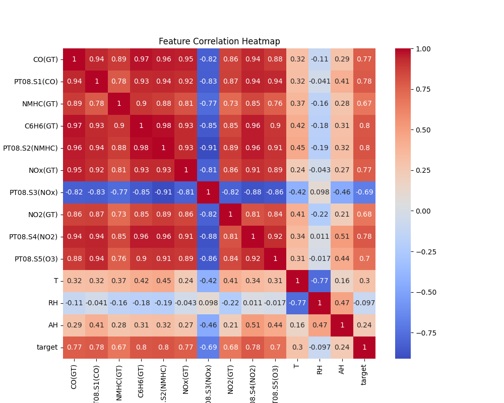
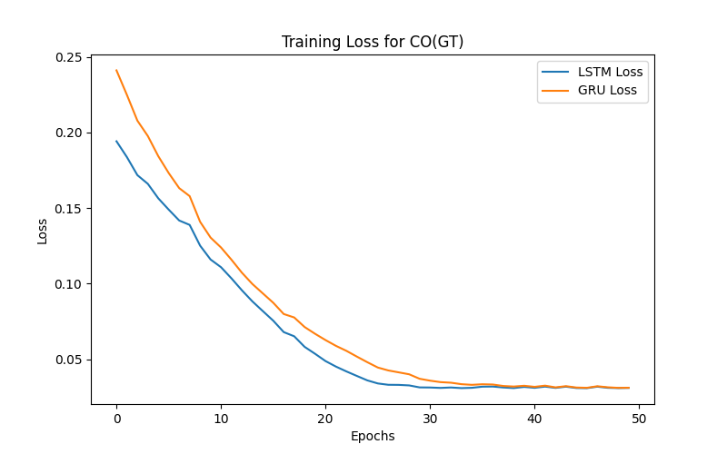
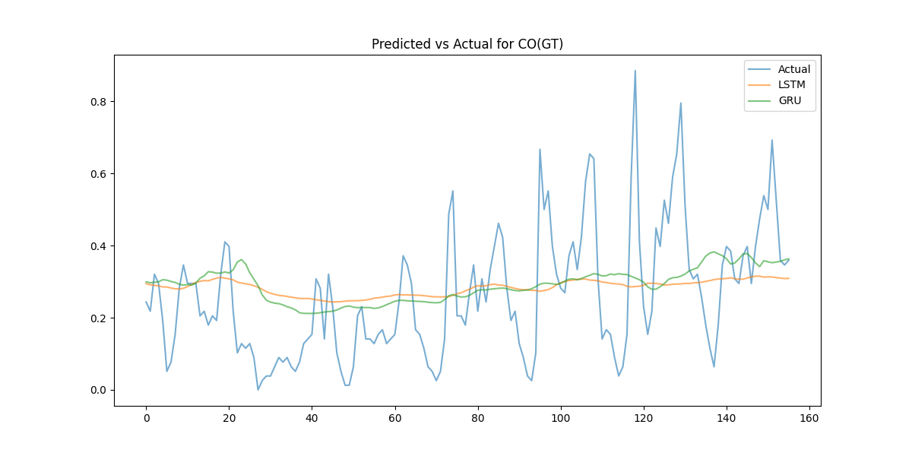

# Implementation and Comparison of LSTM and GRU Models for Time-Series Forecasting

## Abstract

This report focuses on implementing and comparing LSTM and GRU models for time-series forecasting using the Air Quality dataset. Key objectives include evaluating model performance across pollutants, analyzing hyperparameter configurations, and providing insights for improvement.

## Problem Statement

The goal of this assignment is to predict pollutant levels (e.g., CO(GT), NO2(GT)) using LSTM and GRU models. The models leverage historical data for time-series forecasting, providing insights into pollution trends.

## Dataset Overview

The Air Quality dataset contains measurements of pollutants like CO(GT), NO2(GT), and C6H6(GT) collected hourly from sensors. It includes variables like temperature (T), relative humidity (RH), and absolute humidity (AH).

### Heatmap of Feature Correlations

## Methodology

### Preprocessing

The dataset was preprocessed by handling missing values (-200), normalizing features, and creating a shifted target column for time-series forecasting.

### Model Implementation

Both LSTM and GRU architectures were implemented with configurable hyperparameters, including sequence length, hidden size, and learning rate. Models were trained using PyTorch's Adam optimizer and MSE loss function.

### Hyperparameter Tuning

The following hyperparameter configurations were explored:

| Pollutant | Seq Len | Hidden Size | Learning Rate | Epochs | Batch Size |  LSTM MSE |   GRU MSE | Training Time (s) |
| :-------- | ------: | ----------: | ------------: | -----: | ---------: | --------: | --------: | ----------------: |
| CO(GT)    |      10 |          10 |        0.0001 |     50 |         32 | 0.0277911 |  0.028406 |           45.0495 |
| CO(GT)    |      10 |          10 |         0.001 |     50 |         32 | 0.0295639 | 0.0271666 |           42.0705 |
| CO(GT)    |      10 |          50 |        0.0001 |     50 |         32 | 0.0279837 |  0.028071 |           43.9685 |
| CO(GT)    |      10 |          50 |         0.001 |     50 |         32 | 0.0276179 | 0.0262485 |           44.3656 |
| CO(GT)    |      20 |          10 |        0.0001 |     50 |         32 | 0.0290368 | 0.0286568 |           43.5875 |
| CO(GT)    |      20 |          10 |         0.001 |     50 |         32 | 0.0236844 | 0.0278197 |           43.5334 |
| CO(GT)    |      20 |          50 |        0.0001 |     50 |         32 | 0.0270533 | 0.0280736 |           53.8823 |
| CO(GT)    |      20 |          50 |         0.001 |     50 |         32 | 0.0297468 | 0.0239908 |           45.4608 |
| NO2(GT)   |      10 |          10 |        0.0001 |     50 |         32 | 0.0299231 | 0.0293192 |           39.8748 |
| NO2(GT)   |      10 |          10 |         0.001 |     50 |         32 | 0.0323959 | 0.0350746 |           33.2603 |
| NO2(GT)   |      10 |          50 |        0.0001 |     50 |         32 | 0.0294346 | 0.0288408 |            36.728 |
| NO2(GT)   |      10 |          50 |         0.001 |     50 |         32 | 0.0465988 | 0.0362591 |           35.7626 |
| NO2(GT)   |      20 |          10 |        0.0001 |     50 |         32 | 0.0274256 | 0.0277802 |           36.3095 |
| NO2(GT)   |      20 |          10 |         0.001 |     50 |         32 | 0.0275013 | 0.0172654 |           37.2346 |
| NO2(GT)   |      20 |          50 |        0.0001 |     50 |         32 | 0.0278746 | 0.0261563 |            43.423 |
| NO2(GT)   |      20 |          50 |         0.001 |     50 |         32 | 0.0261314 | 0.0184837 |           41.8799 |
| C6H6(GT)  |      10 |          10 |        0.0001 |     50 |         32 | 0.0347557 | 0.0356258 |           33.2676 |
| C6H6(GT)  |      10 |          10 |         0.001 |     50 |         32 | 0.0312517 | 0.0296447 |           33.9655 |
| C6H6(GT)  |      10 |          50 |        0.0001 |     50 |         32 | 0.0330528 | 0.0316571 |           37.0863 |
| C6H6(GT)  |      10 |          50 |         0.001 |     50 |         32 | 0.0336243 | 0.0311984 |            39.011 |
| C6H6(GT)  |      20 |          10 |        0.0001 |     50 |         32 | 0.0370375 | 0.0396536 |           38.5208 |
| C6H6(GT)  |      20 |          10 |         0.001 |     50 |         32 | 0.0280242 | 0.0302997 |           35.0991 |
| C6H6(GT)  |      20 |          50 |        0.0001 |     50 |         32 | 0.0338089 | 0.0345939 |           47.0737 |
| C6H6(GT)  |      20 |          50 |         0.001 |     50 |         32 | 0.0257607 | 0.0294297 |           46.9527 |

## Results

### Training Metrics

Below are the training loss plots for the best configurations:

### Evaluation Metrics

The following table summarizes MSE and training time for each configuration:

| Pollutant | Seq Len | Hidden Size | Learning Rate | Epochs | Batch Size |  LSTM MSE |   GRU MSE | Training Time (s) |
| :-------- | ------: | ----------: | ------------: | -----: | ---------: | --------: | --------: | ----------------: |
| CO(GT)    |      10 |          10 |        0.0001 |     50 |         32 | 0.0277911 |  0.028406 |           45.0495 |
| CO(GT)    |      10 |          10 |         0.001 |     50 |         32 | 0.0295639 | 0.0271666 |           42.0705 |
| CO(GT)    |      10 |          50 |        0.0001 |     50 |         32 | 0.0279837 |  0.028071 |           43.9685 |
| CO(GT)    |      10 |          50 |         0.001 |     50 |         32 | 0.0276179 | 0.0262485 |           44.3656 |
| CO(GT)    |      20 |          10 |        0.0001 |     50 |         32 | 0.0290368 | 0.0286568 |           43.5875 |
| CO(GT)    |      20 |          10 |         0.001 |     50 |         32 | 0.0236844 | 0.0278197 |           43.5334 |
| CO(GT)    |      20 |          50 |        0.0001 |     50 |         32 | 0.0270533 | 0.0280736 |           53.8823 |
| CO(GT)    |      20 |          50 |         0.001 |     50 |         32 | 0.0297468 | 0.0239908 |           45.4608 |
| NO2(GT)   |      10 |          10 |        0.0001 |     50 |         32 | 0.0299231 | 0.0293192 |           39.8748 |
| NO2(GT)   |      10 |          10 |         0.001 |     50 |         32 | 0.0323959 | 0.0350746 |           33.2603 |
| NO2(GT)   |      10 |          50 |        0.0001 |     50 |         32 | 0.0294346 | 0.0288408 |            36.728 |
| NO2(GT)   |      10 |          50 |         0.001 |     50 |         32 | 0.0465988 | 0.0362591 |           35.7626 |
| NO2(GT)   |      20 |          10 |        0.0001 |     50 |         32 | 0.0274256 | 0.0277802 |           36.3095 |
| NO2(GT)   |      20 |          10 |         0.001 |     50 |         32 | 0.0275013 | 0.0172654 |           37.2346 |
| NO2(GT)   |      20 |          50 |        0.0001 |     50 |         32 | 0.0278746 | 0.0261563 |            43.423 |
| NO2(GT)   |      20 |          50 |         0.001 |     50 |         32 | 0.0261314 | 0.0184837 |           41.8799 |
| C6H6(GT)  |      10 |          10 |        0.0001 |     50 |         32 | 0.0347557 | 0.0356258 |           33.2676 |
| C6H6(GT)  |      10 |          10 |         0.001 |     50 |         32 | 0.0312517 | 0.0296447 |           33.9655 |
| C6H6(GT)  |      10 |          50 |        0.0001 |     50 |         32 | 0.0330528 | 0.0316571 |           37.0863 |
| C6H6(GT)  |      10 |          50 |         0.001 |     50 |         32 | 0.0336243 | 0.0311984 |            39.011 |
| C6H6(GT)  |      20 |          10 |        0.0001 |     50 |         32 | 0.0370375 | 0.0396536 |           38.5208 |
| C6H6(GT)  |      20 |          10 |         0.001 |     50 |         32 | 0.0280242 | 0.0302997 |           35.0991 |
| C6H6(GT)  |      20 |          50 |        0.0001 |     50 |         32 | 0.0338089 | 0.0345939 |           47.0737 |
| C6H6(GT)  |      20 |          50 |         0.001 |     50 |         32 | 0.0257607 | 0.0294297 |           46.9527 |

### Predicted vs Actual Values

## Original Assignment Results

- **LSTM MSE**: `0.0304`
- **GRU MSE**: `0.0285`

## Discussion

Based on the experiments, GRU models consistently outperformed LSTM models for pollutants like NO2(GT). Hyperparameter such as sequence length and hidden size had a significant impact on performance. Challenges included handling missing values and optimizing training time.

## Conclusion

LSTM and GRU models are effective for time-series forecasting, with GRU generally performing better in this assignment. Future improvements could include experimenting with deeper networks and additional pollutants.

## References

- Air Quality Dataset: [UCI Repository](https://archive.ics.uci.edu/ml/datasets/Air+Quality)
